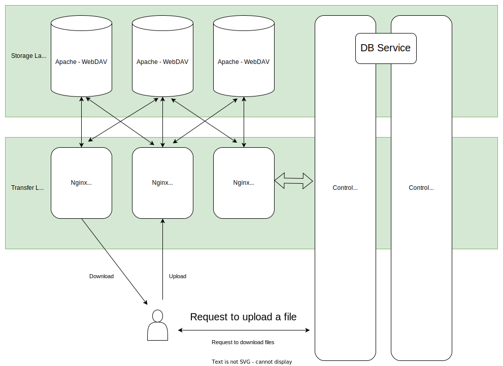

# 钛盘的一些值得分享的技术

很多看起来很复杂很高级的东西，其实要实现起来都不难，只要基本功扎实，理解原理即可。  
钛盘在 2018 年刚刚诞生的时候，就是一个单服务器的架构，上传，下载， API 都在一台单机上，后来一步一步演变，分离了前后端，再分离了存储和 API，才有了今天这个样子。  

期间我们打算用一些业界领先的分布式存储系统来支撑后端，后来发现没有必要，一个是增加了构建成本，另外是谁知道今后会怎么改？所以，如果要深入做什么东西，最终，还是需要适当地解耦，并保持各个组件尽可能可控，可扩展。  

## 目录

- [钛盘的一些值得分享的技术](#钛盘的一些值得分享的技术)
  - [目录](#目录)
  - [钛盘的架构](#钛盘的架构)
    - [前端，后端，数据库](#前端后端数据库)
      - [前端，客户端](#前端客户端)
        - [为什么不是 Vue 或者 React？](#为什么不是-vue-或者-react)
      - [后端，单服务器体系扩展为分布式体系](#后端单服务器体系扩展为分布式体系)
        - [计算节点的平行扩展](#计算节点的平行扩展)
        - [存储的平行扩展](#存储的平行扩展)
    - [数据库](#数据库)
  - [接下来](#接下来)

## 钛盘的架构
看图。  



### 前端，后端，数据库

#### 前端，客户端
大部分的 App 或者又或者是 Web 基本都是基于 MVC 这样的架构构建。  
钛盘前端自 2020 年开始，采用 tmpUI 框架重新编写了 Web 前端，以实现完全分离。这是因为 Web 前端是我们唯一的客户端，随着逐渐增加的各项功能，PHP 模板的方案，开始无法满足需求。  

这里是一些对比点：
* 性能
  * 并不是说 PHP 模板的方案性能不行，不过相比纯 Web 前端，确实把一些计算需求（模板渲染，数据排序）都放到了客户端浏览器上来进行，后端架构可以减少用于 Web 的 PHP 渲染单元（这对于用爱发电的项目来说，显得尤为重要）。
  * 纯 Web 前端由于是静态文件，加载速度会比 PHP 模板快一些，因为 PHP 模板还需要进引擎跑一遍。
  * 更好的多语言支持。
  * 避免精神分裂。
* 开发
  * 完全的模块化，与 PHP 模板一致的开发体验。
  * 完全分离，可并行化开发。虽然在 2020 年来说，感觉很奇怪，不过我们的宗旨是不为不存在的需求买单。钛盘之前确实不需要那么多人一起写，准确的说，原来的前端只需要一个工程师就够了。我们对开发性能的要求是，大部分需求必须能在一天内完成开发及测试。这是基准开发性能的要求。  

为了实现我们的前后端完全分离的愿景，专门设计了 tmpUI 这个框架。  
有了它，就可以像原先写 MVC 架构的 PHP 模板方案那样，进行高效平滑的代码迁移。  

##### 为什么不是 Vue 或者 React？
这曾经是备选方案之一，不过很无奈的是，我们的前端程序员（或者说没有前端程序员）技术栈比较落后，需要更多的时间才能灵活运用 Vue 又或者 React 吧。  
但是， tmpUI 从设计到实施，仅花了一周左右的时间。然后将 PHP 模板化前端代码迁移至 tmpUI，也是一周左右的时间完成。  
更短的研发时间对于产品来说是非常必要的。截至到目前，钛盘前端程序部分，每个新功能或者新特性的研发，基本都不会超过一天。  
tmpUI 起到了非常重要的作用。

#### 后端，单服务器体系扩展为分布式体系
得益于 Nginx + PHP-FPM 的架构，要对后端进行平行化扩展，需要解决的问题并不多。  

##### 计算节点的平行扩展
我们将 PHP 代码集中存储在一台服务器上，并通过 NFS 分享至计算节点（即 API 服务器）。
计算节点可以直接通过批量部署脚本批量部署。  



##### 存储的平行扩展
在最开始的时候，由于是单服务器的架构，因此我们只需要将文件存储到服务器上即可。
现在架构已经发生了改变，为了应对日益增长的存储需求，我们需要在尽可能少改代码的情况下，实现分布式的存储。

这里有一个抉择点：是否将分布式存储交给成熟的组件来做（甚至包括托管给第三方，比如 AWS S3，实际上托管过半年，但是成本太高放弃了）。
经过实践后发现，由于我们的需求不确定，如果交给成熟的组件来做，可能无法定制某些功能，例如我们现在已实现的``可延迟上传合并``，以及``按需备份``。因此我们最后决定还是自行研发，第一阶段的需求，是最基本的需求，那就是基于网络的读写和存储。在这里，我们选择了 WebDAV 作为基底。

PHP 读写 WebDAV 非常简单，这里分享一段 PHP 读写 Web DAV 的代码：  
```php
$ch = curl_init();
$fh_res = fopen($tmp_path_file, 'r');
curl_setopt($ch, CURLOPT_URL, "{$req_node}");
curl_setopt($ch, CURLOPT_USERPWD, "{$req_node_token}");
curl_setopt($ch, CURLOPT_PUT, 1);
curl_setopt($ch, CURLOPT_INFILE, $fh_res);
curl_setopt($ch, CURLOPT_INFILESIZE, filesize($tmp_path_file));
curl_setopt($ch, CURLOPT_RETURNTRANSFER, 1);
```
我们只需要把原先对接 AWS S3 的代码稍微改改，就能继续让整个系统继续运行。  
而在运维方面，一台全新的服务器，通过批量部署脚本，也可以在 5 分钟内上线成为可用节点。  

### 数据库
直接使用自家的 DB Service 服务。  
现成的东西，就不多费力气了。

## 接下来
讲讲钛盘如何使用 Nginx + PHP-CLI + Apache 构建分布式存储系统。